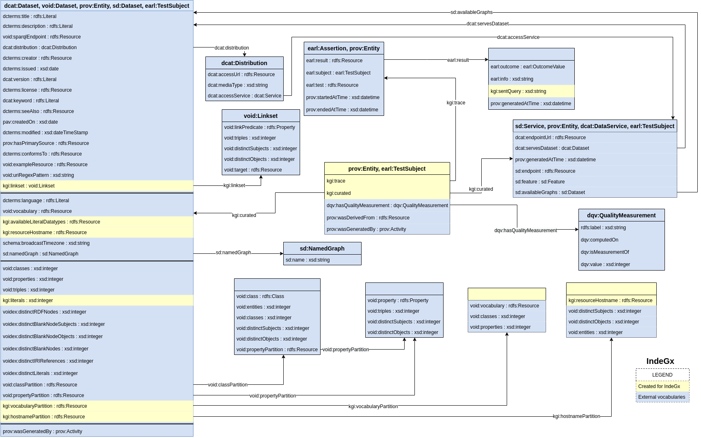

# IndeGx

[](https://fair-software.eu) [](https://www.gnu.org/licenses/gpl-3.0)

This depot contains the code and data files created by the WIMMICS team as part of the [DeKalog project](https://dekalog.univ-nantes.fr). The goal of the WIMMICS team in this project is the building of a framework for the creation of an index of a set of SPARQL endpoints. The framework relies only on available semantic web technologies and the index appears as an RDF database. The index is primilarly composed of the self-description available in the endpoint. This original description is verified and expanded by the framework, using SPARQL queries.

- [code/](https://github.com/Wimmics/dekalog/tree/master/code) contains the code and executable of the framework application
- [rules/](https://github.com/Wimmics/dekalog/tree/master/rules) contains the rules followed by our framework for the generation of an endpoint description in our index.
- [docs/](https://github.com/Wimmics/dekalog/tree/master/docs) contains the preliminary design document in which we discussed the basic concepts and methods used in our framework.
- [LODMap/](https://github.com/Wimmics/dekalog/tree/master/LODMap) contains the code for the [KartoGraphI website](http://prod-dekalog.inria.fr/).
- The file [template-description.ttl](https://github.com/Wimmics/dekalog/blob/master/template-description.ttl) is a basic template for the description of knowledge bases.

# To Cite This Work

To cite this work:
```
@inproceedings{maillot:hal-03652865,
    TITLE = {{KartoGraphI: Drawing a Map of Linked Data}},
    AUTHOR = {Maillot, Pierre and Corby, Olivier and Faron, Catherine and Gandon, Fabien and Michel, Franck},
    URL = {https://hal.archives-ouvertes.fr/hal-03652865},
    BOOKTITLE = {{ESWC 2022 - 19th European Semantic Web Conferences}},
    ADDRESS = {Hersonissos, Greece},
    PUBLISHER = {{Springer}},
    YEAR = {2022},
    MONTH = May,
    KEYWORDS = {linked data ; semantic web}
}
```

## Metadata generated by IndeGx
[](https://github.com/Wimmics/dekalog/blob/master/docs/KG_Schema_UML-like.drawio.png)
